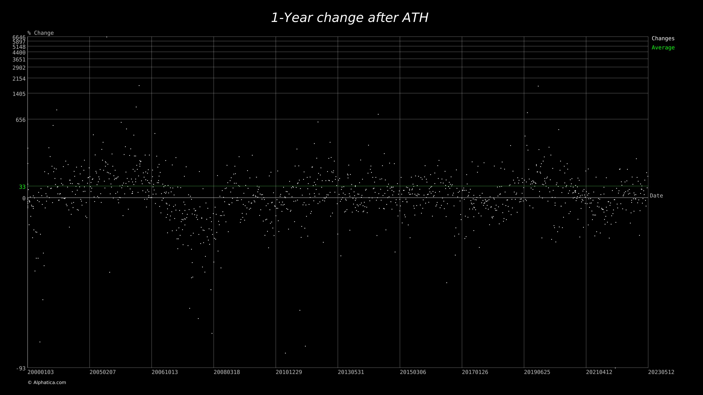

# Various checks based on current market data

## Checking market change following All-Time-High

[Source](./src/main/java/com/alphatica/alis/examples/changecheck/AllTimeHighChangeCheck.java)

Checks for an average change during one-year after all-time-high was reached on
stocks' prices.

Results (2000-01-01 - 2023-05-12):

```
Average: 29.4
Median: -2.9
Time average: 31.3
Count: 17282
```

After removing overlapping:

```
Average: 33.4
Median: 55.7
Time average: 34.7
Count: 1191
```



## Checking current Min-Max indicator values

Min-max can be used to identify long term trends. It is similar to Simple
Moving Average, but with less whipsaw. More about the
indicator: [https://alphatica.com/pl/blog/min-max/](https://alphatica.com/pl/blog/min-max/)

[Source](./src/main/java/com/alphatica/alis/examples/minmax/MinMaxNow.java)